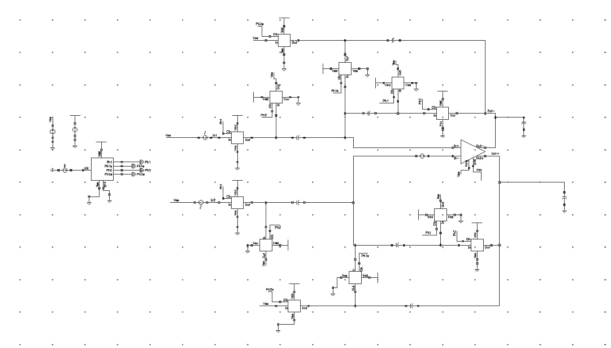

# Correlated Double Sampling (CDS) Sensor Interface

## Overview

This project implements a **switched-capacitor sensor interface with Correlated Double Sampling (CDS)** using **Cadence Virtuoso**.

The circuit is designed to reduce **input-referred DC offset** and improve the accuracy of the sensor signal. The design consists of a non-overlapping clock generator, CMOS switches, sampling capacitors, and a **fully differential op-amp macromodel**.

## Features

- Implements **Correlated Double Sampling (CDS)** for input offset cancellation.
- Reduces **input-referred DC offset** and low-frequency noise.
- Uses non-overlapping clock phases **Ph1 and Ph2** along with their early versions.
- Uses CMOS switches for switched-capacitor operation.
- Uses sampling capacitors for offset and signal sampling.
- Uses a **fully differential op-amp macromodel**.
- Designed and simulated using **Cadence Virtuoso**.

## Circuit



## Main Components

### 1. Non-Overlapping Clock Generator

The clock generator generates two non-overlapping clock phases:

- **Ph1**
- **Ph2**

Their early versions are also generated and used to control the switching sequence of the circuit.

### 2. CMOS Switches

CMOS switches are used to control the connection of the sampling capacitors during different clock phases.

They allow the capacitors to sample the offset and input signal and perform charge redistribution during the CDS operation.


### 3. Sampling Capacitors

The capacitors store the sampled voltage during the different clock phases.

They form the main storage elements of the switched-capacitor CDS circuit and enable the offset cancellation through charge redistribution.

### 4. Fully Differential Op-Amp

A **fully differential op-amp macromodel** is used as the amplification stage.

The op-amp provides differential amplification for the switched-capacitor signal path.

> Note: The op-amp is used as a macromodel and is not designed at the transistor level as part of this project.

## Correlated Double Sampling

CDS operates using two sampling phases.

### Ph1 – Offset Sampling

During **Ph1**, the circuit samples the input-referred offset of the amplifier and stores the corresponding charge on the sampling capacitors.

### Ph2 – Signal Sampling

During **Ph2**, the input signal is sampled. The previously stored offset information is used during charge redistribution to cancel the amplifier offset.

The basic principle is:

```text
Sample 1 = Voffset

Sample 2 = Vinput + Voffset

Output = Sample 2 - Sample 1

Output = Vinput
